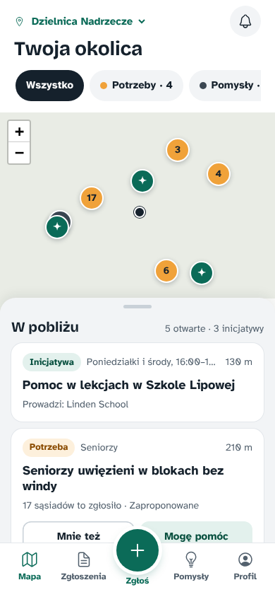
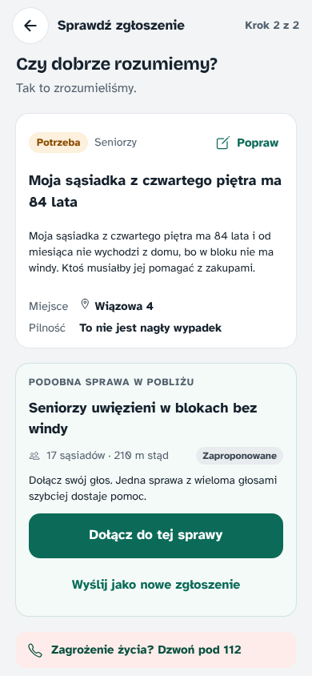
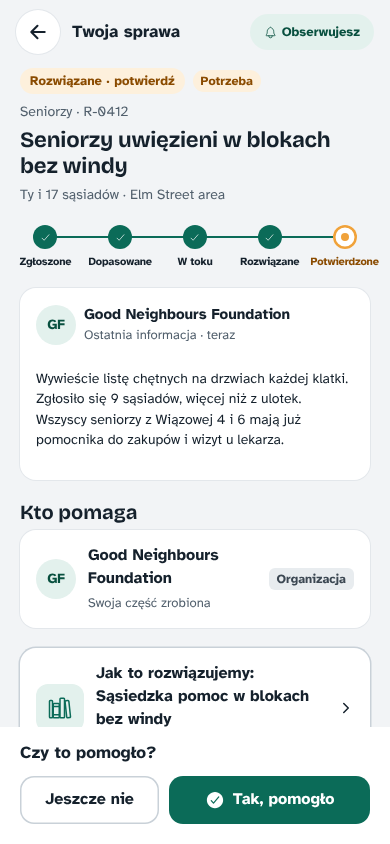
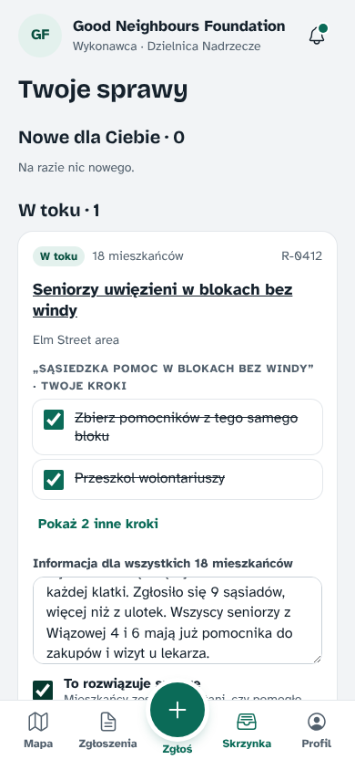
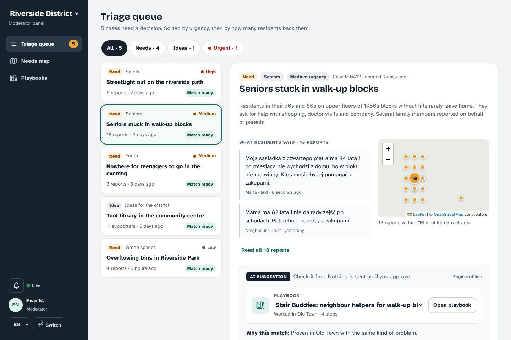
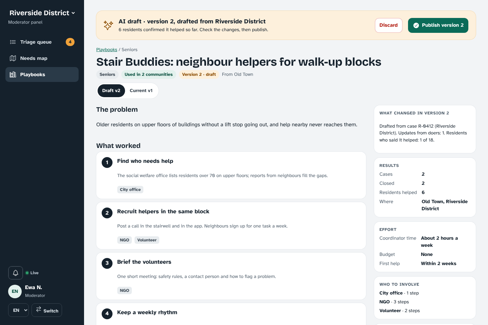

# Needs-to-Solutions Platform

Residents report problems by voice, text or photo. The AI groups similar reports into one case, finds a
playbook that already worked in another community, and proposes who should act. A moderator approves,
doers (city offices, NGOs, volunteers) work through a checklist, and residents confirm it helped. Each
solved case improves the playbook, so the next community starts from a better recipe.

One platform fits a city district, a university campus or a housing co-op: categories, status names,
roles and privacy rules are configuration, not code. Source code, database names and API keys are
English; everything people read comes back in their language (Polish, English and Ukrainian in the demo).

**Prezentacja (PL):** [PDF](docs/Neighbourhood-Needs-prezentacja.pdf) ·
[PowerPoint](https://github.com/seelso-net/hackyeah-2026-malopolska/raw/main/docs/Neighbourhood-Needs-prezentacja.pptx)

| Resident (phone) | | | Doer (phone) |
| --- | --- | --- | --- |
|  |  |  |  |

| Moderator: the AI's proposal, approved with one click | Moderator: the AI's next playbook version |
| --- | --- |
|  |  |

## Run it

**Docker (easiest).** Needs Docker only.

```bash
docker compose up --build          # http://localhost:8080, demo data loaded
```

Open http://localhost:8080 and pick a person (no passwords in the demo). Every start reloads the demo
data; `DEMO_RESET=false docker compose up` keeps your changes. API docs: http://localhost:8080/q/swagger-ui.

**Dev mode** (live reload for both). Needs JDK 21, Node 22 and Docker (Quarkus starts PostgreSQL with
pgvector for you).

```bash
cd backend && ./mvnw quarkus:dev   # API on :8080, Dev UI at http://localhost:8080/q/dev-ui
cd app && npm install && npm run dev   # app on http://localhost:5173, proxies /api to :8080
```

After changing the API, `npm run api:types` (in `app/`) regenerates the TypeScript types from `/q/openapi`.

**Plain JVM.** Needs JDK 21, Node 22 and a PostgreSQL 15+ with the `vector` extension available.

```bash
(cd app && npm ci && npm run build)
mkdir -p backend/src/main/resources/META-INF/resources && cp -r app/dist/. backend/src/main/resources/META-INF/resources/
cd backend && ./mvnw package
DB_URL=jdbc:postgresql://localhost:5432/needs DB_USER=postgres DB_PASSWORD=postgres \
  java -jar target/quarkus-app/quarkus-run.jar
```

Flyway creates the schema and loads the demo data on first start. `/q/health/started` turns UP once
the startup AI work (vectors for the seed data, suggestions for waiting cases) is done.

## The demo

Maria's case, end to end, takes about three minutes with two browser windows (or a phone and a laptop).

1. **Maria** (resident, Polish, on a phone): tap **+ Zgłoś** and describe, typing or dictating, that her
   84-year-old neighbour cannot leave a block without a lift. The AI reads it and finds case R-0412
   nearby with 17 similar reports: **Dołącz do tej sprawy** (join this case).
2. **Ewa** (moderator, English, desktop): the triage queue already holds the AI's proposal for R-0412:
   the Stair Buddies playbook proven in Old Town, plus an NGO, the welfare office and volunteers who
   live nearby. **Approve and assign**.
3. **Kasia** (doer for Good Neighbours Foundation, Polish): accept, tick her checklist steps, write what
   worked and mark **To rozwiązuje sprawę** (this resolves the case).
4. **Maria**'s screen asks **Czy to pomogło?** (did this help?) without a reload: **Tak, pomogło**.
5. **Ewa** opens the playbook: the AI drafted version 2 with the new step Kasia's team discovered.
   **Publish version 2**: the next district to report this problem starts from a better recipe.
6. **Piotr** (admin) shows that a campus or a co-op is just another configuration. **Ola** sees the
   same map in Ukrainian.

| Login | Who | Language |
| --- | --- | --- |
| `maria` | Resident of Riverside; her report is the demo | pl |
| `ewa` | Riverside moderator | en |
| `kasia` | Doer for Good Neighbours Foundation (NGO) | pl |
| `jan` | Doer for Riverside Social Welfare Office | pl |
| `anna`, `tomasz`, `ola` | Residents who volunteer nearby | pl, pl, uk |
| `zofia` | Old Town moderator (Stair Buddies started there) | pl |
| `piotr` | Admin of all four communities | en |
| `neighbour-01` … `neighbour-17` | Residents behind the seeded reports | pl / uk |

Four communities show that one platform fits many shapes: `riverside` (city district, pl/en/uk, the
demo), `old-town` (where the Stair Buddies playbook was proven), `north-campus` (a university) and
`oak-street-coop` (a housing co-op with its own status names and a members-only map).

`./scripts/demo-flow.sh` runs the same story through the REST API with curl and jq (`PAUSE=1` waits for
Enter between steps, for presenting); restart the app first so the demo data is fresh.

## The app

`app/` is one Ionic React code base for the browser, an installable PWA and an Android app (Capacitor).
Each person lands on their own surface:

- **Residents**: a map of needs, ideas and initiatives nearby; "me too" and "I can help" on every
  case; a two-step report (voice with live transcription, text, photos, location) with the AI's reading
  and a similar case to join; case status with a progress stepper, updates and "did this help?"; my
  reports; the ideas library (search by meaning); profile and language.
- **Moderators**: triage queue sorted by urgency and support; each case with every report, a map, and
  the AI's proposal (playbook, alternatives, doers with reasons, plus residents who offered help) to
  approve as is or adjusted. On phones the side panel becomes a top bar.
- **Doers**: new offers to accept, redirect or decline; active cases with their own checklist steps and
  an update (with photos) for every resident on the case.
- **Playbooks**: steps, who to involve, effort and results; AI drafts show what changed, with publish
  and discard.
- **Admins**: categories, status names, role descriptions and rules per community, with JSON import
  and export.

Everything updates live over server-sent events (toasts and the bell). Strings live in
`app/src/i18n/{en,pl,uk}.ts` with proper plural forms; people's own text shows a "Machine translated ·
Show original" switch when the AI translated it.

**Android.** The API must be reachable from the phone (deployed, or your laptop's address on the same
Wi-Fi). Needs Android Studio.

```bash
cd app
VITE_API_URL=https://your-app.example.org npm run build && npx cap sync android && npx cap open android
```

Launcher icons and splash screens come from `app/assets/` (`npx @capacitor/assets generate --android`).

**PWA.** Open the deployed site in Chrome or Safari and choose "Install" / "Add to Home Screen".

## API

All paths start with `/api`; keys are English camelCase, enums travel as codes plus a translated label,
and people's text arrives as `{text, lang, machineTranslated, original}`. Sign in by sending
`X-Demo-User: <login>` (or `?as=<login>` where headers are impossible, such as `EventSource` and
``); `X-Lang: pl|en|uk` (or `?lang=`) picks the reader's language. Calls that start AI work return
`202 Accepted`, and the result arrives on the event stream. Errors are `{status, error}`.

| Endpoint | Who | Does |
| --- | --- | --- |
| `GET /communities/{slug}` | anyone | Categories, status labels and languages for the UI |
| `GET /map?community=&bbox=&layers=` | anyone (members for private maps) | Public cases with rounded locations, plus initiatives |
| `POST /reports` | signed in | Multipart (`text`, `audio`, `photo`…) or JSON; returns 202 |
| `GET /reports/{id}` | author, moderators | What the AI understood and the closest open case |
| `POST /reports/{id}/submit` | author | `{"caseId": …}` joins that case; no id opens a new one |
| `GET /cases/{id}` | whoever can see the case | Timeline, who is helping, checklist, playbook used |
| `POST /cases/{id}/support` | residents | "Me too" / "I support this idea"; idempotent |
| `POST /cases/{id}/help-offers` | residents | "I can help" with an optional note; moderators see it next to the AI's picks |
| `POST /cases/{id}/outcome` | linked residents | `HELPED` confirms the case; `NOT_HELPED` reopens it |
| `GET /me/cases` | signed in | Cases I reported, joined, support or help with |
| `GET /stream` | signed in | Server-sent events for everything the caller may see |
| `GET /moderation/queue?community=` | moderators | Waiting cases by urgency then support, with AI status |
| `GET /moderation/cases/{id}` | moderators | Every report, the timeline and the pending suggestion |
| `POST /moderation/suggestions/{id}/approve` | moderators | Optional `playbookVersionId` and `actorIds` override the AI |
| `GET /doer/assignments?status=` | doers | New and active assignments for the caller's organisation |
| `POST /assignments/{id}/accept` (`/decline`, `/redirect`) | the assigned doer | Decline and redirect take `{"note": …}` |
| `PATCH /tasks/{id}` | accepted doers, moderators | `{"done": true}` ticks a checklist step |
| `POST /cases/{id}/updates` | accepted doers, moderators | Text and photos for residents; `resolve=true` resolves |
| `GET /playbooks?community=&q=` | anyone | The ideas library; `q` searches by meaning |
| `GET /playbooks/{id or slug}` | anyone | Current version, waiting draft, results, history |
| `POST /playbooks/{id}/versions/{n}/publish` | moderators | Makes the draft current; the old version is archived |
| `DELETE /playbooks/{id}/versions/{n}` | moderators | Discards a draft |
| `GET` / `PUT /admin/communities/{slug}/config` | admins | Export or import a community's whole configuration |

Also: `GET /api/communities`, `GET /api/me`, `GET /api/media/{id}`, `/q/health`, `/q/swagger-ui` and
`/q/openapi`.

Live event types: `REPORT_PROCESSED`, `SAFETY_ALERT`, `REPORT_ADDED`, `STATUS_CHANGED`,
`MATCH_SUGGESTED`, `MATCH_APPROVED`, `ASSIGNMENT_ACCEPTED`, `ASSIGNMENT_DECLINED`, `TASK_UPDATED`,
`UPDATE_POSTED`, `CASE_SUPPORTED`, `HELP_OFFERED`, `OUTCOME_RECORDED`, `PLAYBOOK_DRAFTED`,
`PLAYBOOK_PUBLISHED`, `CONFIG_CHANGED`, plus `CONNECTED` and a `HEARTBEAT` every 20 s. Each carries ids
and codes; the app writes the sentence in the reader's language.

## AI modes

| | `AI_MODE=offline` (default) | `AI_MODE=llm` |
| --- | --- | --- |
| Needs | nothing | any OpenAI-compatible API: OpenAI, Ollama, vLLM, LM Studio… |
| Reading a report | keyword rules per category, urgency and injury words | the chat model returns codes, title and summary in every community language |
| Similar cases and playbooks | hashed word, stem and trigram vectors; matches words, not meaning | real embeddings; matches meaning across languages |
| Choosing playbook and doers | similarity, category, distance and service radius | vector search narrows, the chat model picks and explains |
| Translation | none (readers see the original) | people's text is translated and flagged as machine-translated |
| Playbook drafts | copies the steps and adds the doers' latest learning | rewrites the steps from everything the doers reported |

Vector search always narrows the candidates first, so the model only ever chooses among real ids. If a
chat call fails, that step falls back to the offline engine and the demo keeps going. Switching the
embedding model is safe: the app notices at startup and recomputes every stored vector.

```bash
# OpenAI
AI_MODE=llm OPENAI_API_KEY=sk-... docker compose up
# Ollama on this machine (pull a chat model and a multilingual embedding model first)
AI_MODE=llm OPENAI_BASE_URL=http://host.docker.internal:11434/v1/ OPENAI_API_KEY=ollama \
  CHAT_MODEL=qwen2.5:7b EMBEDDING_MODEL=bge-m3 docker compose up
```

## Configuration

| Variable | Default | Meaning |
| --- | --- | --- |
| `DB_URL` (or `DB_HOST`, `DB_PORT`, `DB_NAME`), `DB_USER`, `DB_PASSWORD` | local `needs` database | PostgreSQL with pgvector (production profile) |
| `DEMO_RESET` | `false` (`true` in Docker Compose) | Wipe the database at startup and reload the demo data |
| `AI_MODE` | `offline` | `offline` or `llm` |
| `OPENAI_API_KEY`, `OPENAI_BASE_URL` | none, OpenAI | Any OpenAI-compatible endpoint |
| `CHAT_MODEL`, `EMBEDDING_MODEL` | `gpt-4o-mini`, `text-embedding-3-small` | Model names at that endpoint |
| `MEDIA_DIR` | `data/media` | Where photos and voice notes are stored |
| `PORT` | `8080` | HTTP port (cloud platforms set it) |
| `VITE_API_URL` (app build) | same origin | The API's address, for the Android app or a separately hosted web app |

Matching thresholds live in `backend/src/main/resources/application.properties` (`app.matching.*`).
Each community's categories, status names, roles and rules (merge radius, map rounding, auto-close
days, public map) live in its configuration JSON, editable on the admin screen.

## Deploy

The app is one container (the web app is served by the API) plus PostgreSQL with pgvector. Deploy it
behind HTTPS: phones only allow the microphone, camera and location on secure sites.

**Render (one click, free to start).**
[](https://render.com/deploy?repo=https://github.com/seelso-net/hackyeah-2026-malopolska)

`render.yaml` creates the web service and a PostgreSQL database in Frankfurt and wires them together;
the first build takes about ten minutes. A free web service sleeps after 15 minutes without visitors and
takes a minute or two to wake up (with the demo data reloaded), so before a presentation switch it to
the 0.5 CPU instance in its Settings. A free database expires after 30 days.

**Your own server.** Any Linux machine with Docker and ports 80 and 443 open; Caddy adds HTTPS
(`<ip-with-dashes>.sslip.io` works when you have no domain):

```bash
git clone https://github.com/seelso-net/hackyeah-2026-malopolska && cd hackyeah-2026-malopolska
DOMAIN=203-0-113-7.sslip.io docker compose -f docker-compose.yml -f docker-compose.https.yml up -d --build
```

**Any other container host** (Railway, Fly.io, Google Cloud Run, Azure Container Apps…): build the
`Dockerfile`, or use the image CI publishes to `ghcr.io/<owner>/<repo>:latest`. Give it a PostgreSQL
with pgvector (Neon and Supabase have free plans) through `DB_URL`, or `DB_HOST`, `DB_PORT` and
`DB_NAME`, plus `DB_USER` and `DB_PASSWORD`; add `DEMO_RESET=true` for a demo that resets on every
start. Point the health check at `/q/health/ready`, and run a single instance: live updates are held in
memory. Photos go to local disk in `MEDIA_DIR`; mount a volume there, or swap `support/MediaStorage`
for S3-compatible storage. The app needs about 300 MB of memory, so 512 MB instances are enough.

A package published from a private repository is private too: run `docker login ghcr.io` on the host
first, or make the package public in its GitHub settings.

## Tests and CI

```bash
cd backend && ./mvnw test                         # unit tests: offline AI rules, similarity, text flags, labels
./scripts/demo-flow.sh                            # the API story against a fresh app
python app/e2e/click_through.py                   # every screen, every role, with screenshots (Playwright)
python app/e2e/navigation.py                      # links, typed addresses, back and forward
```

`.github/workflows/ci.yml` runs the unit tests and the app build on every push and pull request, then
builds the Docker image, starts it with PostgreSQL and runs all three end-to-end checks against it
(screenshots are kept as a build artifact). Pushes to `main` then publish the image.

## Code map

```
backend/src/main/java/app/needs/
  model/      entities (Panache), enums, JSON value types such as LocalizedText and CommunityConfig
  ai/         Ai facade, OfflineAi, LlmAi and the langchain4j AI services in ai/llm
  service/    intake, matching, cases, volunteers, assignments, playbooks, vectors, translations, jobs
  api/        REST resources, view models (CaseViews), access rules (Access)
  support/    demo login, reader's language, live events, media storage, web app routing
backend/src/main/resources/db/migration/    V1 schema, V2 demo data
app/src/
  api/        typed client (openapi-fetch) and the types generated from /q/openapi
  session/    who is signed in, language, community; queries scoped to all three
  live/       the event stream: refreshes what changed, shows notices
  pages/      resident/, moderator/, doer/, playbook/, admin/, sign-in
  components/ map, stepper, timeline, tags, navigation, panel layout
  i18n/       en, pl, uk
app/android/  the Capacitor Android project
app/e2e/      browser checks (Playwright)
scripts/      demo-flow.sh (the API story), wait-ready.sh
```

## Known limits

- Demo login only: replace `support/CurrentUser` with `quarkus-oidc` before real residents use it.
- The live event hub is in memory, so run one instance (or move it to Redis or Postgres `LISTEN/NOTIFY`).
- Voice notes are stored, not transcribed on the server: the app sends the browser's live transcript
  (Web Speech API, in Chrome and Safari) as the report text.
- Offline mode does not translate: new reports and updates reach other readers in the language they
  were written in (the seeded map and playbook summaries are written in all three languages).
  `AI_MODE=llm` translates them.
- Not built yet from the MVP design: rejecting a suggestion, editing and merging cases, editing playbook
  drafts by hand, and a doer directory.
